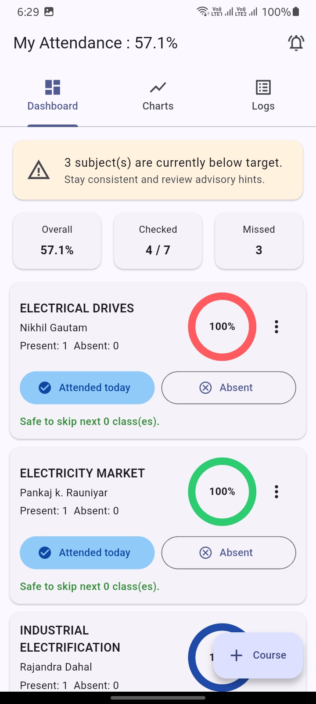
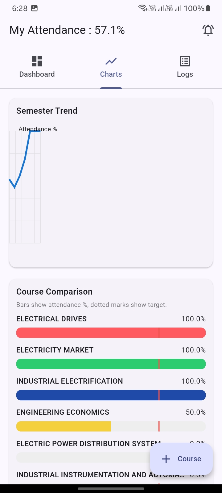
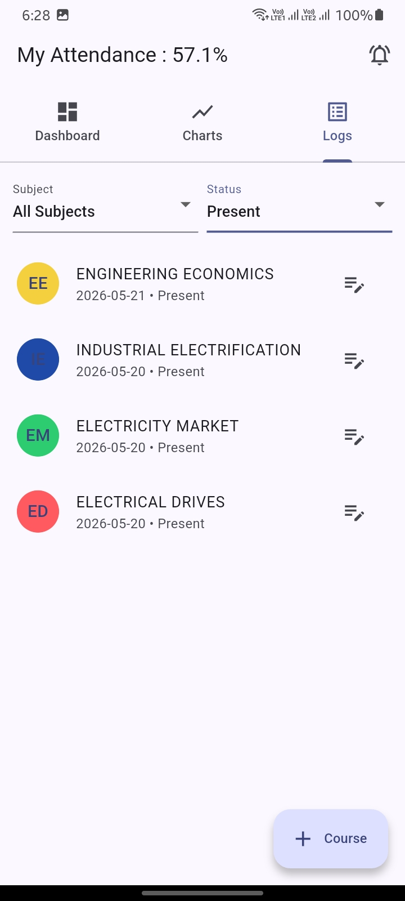

# Attendance

Track semester attendance for all your courses in one place. Mark **Attended** or **Absent** each day, set targets per subject, and watch your overall percentage update on the dashboard, charts, and log.

---

## Download & try (Android)

1. **Download the APK**
   - From **[GitHub Releases](https://github.com/AjaySharma-1/MyAttandanceTracker/releases)** (recommended), or  
   - Build it yourself (see [Build the APK](#build-the-apk) below).
2. **Install on your phone**
   - Open the downloaded `app-release.apk`.
   - If Android asks, allow **Install from unknown sources** for your browser or Files app.
   - Tap **Install**, then **Open**.
3. **Try the app**
   - Add your courses (name, instructor, target %).
   - Use **Attended** / **Absent** on the dashboard for today.
   - Switch tabs to see **Charts** and **Logs**.

> **Note:** All data stays on your device. No account or internet required after install.

---

## Screenshots

Place your three images in `docs/screenshots/` with these exact names:

| Screen | Save as |
|--------|---------|
| Dashboard | `docs/screenshots/dashboard.png` |
| Charts | `docs/screenshots/charts.png` |
| Log | `docs/screenshots/logs.png` |

### Dashboard

Overall attendance, summary cards, per-course progress rings, and quick daily **Attended** / **Absent** buttons.



### Charts

**Semester Trend** line chart and bar charts comparing each course’s attendance % to its target.



### Log

Full history of marks, with filters by course and present/absent, plus edit for date, status, and notes.



---

## Features

- **Dashboard** — `My Attendance : X%` in the app bar, overall stats, target alerts, and one-tap check-in per course
- **Charts** — Trend over time and course vs target comparison
- **Log** — Searchable, filterable attendance history with edit support
- **Courses** — Add, edit, or delete subjects with custom colors and target %
- **Reminders** — Low-attendance alert when any course is below target (once per day)
- **Offline** — Saved locally with `shared_preferences`

---

## Build the APK

If you want to generate the install file yourself:

```bash
flutter pub get
flutter build apk --release
```

Output file:

`build/app/outputs/flutter-apk/app-release.apk`

Copy that file to your phone (USB, cloud drive, or messaging app) and install it the same way as in [Download & try](#download--try-android).

